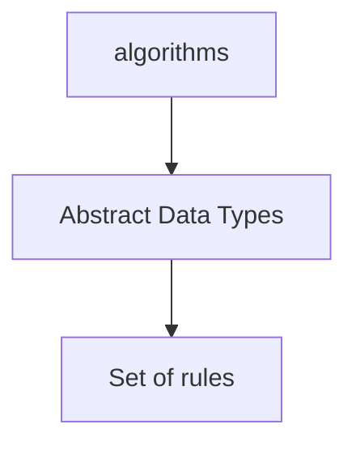
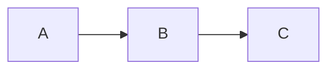
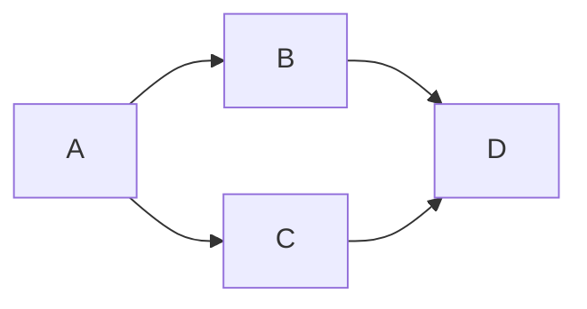

# Basic of Data Structures
What are the basic  to learn data structures

@ Resurces 
<a href = "https://www.javatpoint.com/data-structure-tutorial">javaTpoint</a>

## What you should known about Data Structures

The Data Structures are Algoritms that allow us to make a management of the data in the memory.

there are two main data structures
- Primitive Data Structures
- Non-primitive Data Structures

## Primitive Data Structures

Thouse are the primitive data types that we know sush as Integers, Booleans, Characters, Pointers or Float/Double. The Primitive data structures can only storage one value.

## Non Primitive Data Structures

There are two kinds of Non Primitive Data Structures
- Linear Data Structure
- Non-linear Data Structure

### Linear Data Structure

The linear Data Structures take their name for the relation between their elements, and just one element is related with other element, like this:

Some examples are: Arrays, Queues,Stack and Linked List.

### Non Linear Data Structure

In the non linear data strucutre an element can be related with n number of elements 

Some examples are: Threes and Graphs

Other data strucure clasification

- Static data strucutres
- Dynamic data structures

## Major Operations in Data Structures
- Searching : is one of the essential operations in the use of data structures, it alows you to find an element in the data structure
- Sorting: Other esential operation that are done in the data structures are sort elements inside the data structure, usualy you see how to make this proces quick by chousing different algorithms, that can sort your data in diferent orders.
- Insertio: Insert elements in your data structures is fundamental to add the elements in a define kind of data structure.
- Updation: Change the elements in to a data structure is other of the operations that we see, for example changing the value of one element for a new value
- Deletion: If you can add elements to your data structures is important also have the posibility to delete that element from the data structure

## And now what?

Now that you now the esentials tools for the data structure lets beging with an exercice.
(Link del repo del ejercicio)

## Advantages of the data structures

Known the data structures brings some advantajes for exaple:
- Efficiency: efficiency is one of the advantages that brings you the use of data structures, in terms of space an time in your data bases or programs.
- Reusability: Other of the advantages and one key to our pass through the world of programing.
- Abstraction: Having a data structure implemented into your programs give them a structure that can be esaly learn by other programers and at the same time, the implementation is essely used by the client with out knowing that are the process in side the program, in to the data structure.
